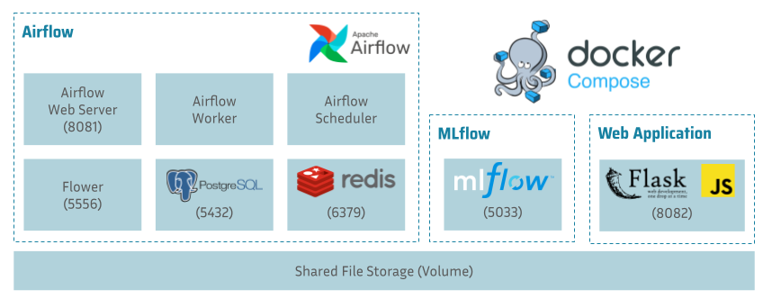
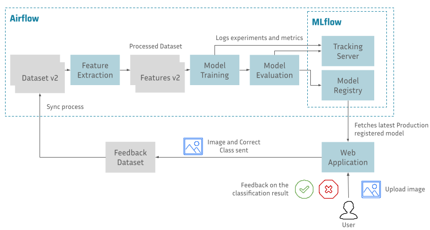

# FSDL 2021 Project

This project was developed as the final project for the Full Stack Deep Learning (FSDL) 2021 course. Our objective was to develop a project to exercise end-to-end ML workflows in a simple classification scenario, learning the following concepts:
* Experiment tracking
* Data, training, and evaluation pipelines
* Model registry and deployment
* Integration of deployed model with Web Application

- [FSDL 2021 Project](#fsdl-2021-project)
  - [Additional information](#additional-information)
  - [Architecture](#architecture)
    - [Containers Organization](#containers-organization)
    - [Overall Workflow](#overall-workflow)
  - [Setup](#setup)
    - [Download the Dataset](#download-the-dataset)
    - [Creating environment variables](#creating-environment-variables)
    - [Creating Airflow environment variables](#creating-airflow-environment-variables)
    - [Starting the System](#starting-the-system)
    - [Accessing Airflow UI](#accessing-airflow-ui)
    - [Accessing MLFlow UI](#accessing-mlflow-ui)
    - [Accessing Web App UI](#accessing-web-app-ui)
    - [Cleaning up MLFlow data (optional)](#cleaning-up-mlflow-data-optional)
  - [Note](#note)


## Additional information
* Youtube video with a short description of the project - https://youtu.be/IRCdqQslQbU
* Report with key lessons learned and more details - [Project Report](docs/project_report.pdf)

## Architecture

### Containers Organization


### Overall Workflow


## Setup

### Download the Dataset

We used a reduced version of the [Intel Scenes Dataset](https://www.kaggle.com/puneet6060/intel-image-classification), which you can download from [Google Drive](https://drive.google.com/drive/folders/1PACy3ENNqSz0LfhNbg9qyY6GIZxN2uIp?usp=sharing).

You should download the folder into `/data/raw/` and unzip the folders, so that you have `/data/raw/intel_scene_images/seg_train_1000` and `/data/raw/intel_scene_images/seg_train_300`.

### Creating environment variables

Create a file called .env containing the environment variables for all services.

```
touch .env
```

Add the following variables.
```bash
POSTGRES_DB=airflow
POSTGRES_USER=airflow
POSTGRES_PASSWORD=airflow

MLFLOW_SERVER_PORT=5033
MLFLOW_ARTIFACT_ROOT=./storage/artifacts/
MLFLOW_BACKEND_STORE_URI=sqlite:///storage/database/mlflow.db
MLFLOW_TRACKING_URI=http://mlflow:${MLFLOW_SERVER_PORT}

AIRFLOW_PORT=8081
FLOWER_PORT=5556

FLASK_PORT=8082

RAW_DATA_DIR=/workspace/data/raw/
FEEDBACK_DATA_DIR=/workspace/data/feedback/
PROCESSED_DATA_DIR=/workspace/data/processed/
```

**IMPORTANT:** Do not version this file in git.

### Creating Airflow environment variables

Simply run the following command in the root directory of this repository
```
./docker/airflow/init_env.sh
```

Check the environment variables `AIRFLOW_UID` and `AIRFLOW_GID` were created in the `.env` file. Also, double-check the directories `src/pipelines/logs` and `src/pipelines/plugins` were created.

### Starting the System

Build Docker images
```
docker-compose build
```

Start containers
```
docker-compose up
```

In case you want to stop
```
docker-compose down
```

### Accessing Airflow UI
You should be able to open Airflow UI in `http://<host_ip>:8081` (or the port you specified in `AIRFLOW_PORT`).

### Accessing MLFlow UI
You should be able to open MLFlow UI in `http://<host_ip>:5033` (or the port you specified in `MLFLOW_SERVER_PORT`).

### Accessing Web App UI
You should be able to open Web App UI in `http://<host_ip>:8082` (or the port you specified in `FLASK_PORT`).

### Cleaning up MLFlow data (optional)

Simply run the following command in the root directory of this repository
```
./docker/mlflow/clean_mlflow_data.sh
```

## Note
This solution is not production-ready. Airflow can be further optimized for production as well as the Flask application.